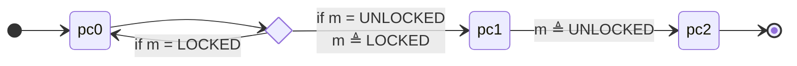

# Lecture 26: Liveness

::: warning Draft

This lecture is still a draft.

:::

## Learning outcomes

1. Understand how fairness makes liveness complicated
2. Explain the meaning of an LTL liveness specification

---

$$
\gdef\always{\box}
\gdef\eventually{\Diamond}
% \lift reuses macro and notation from Iris
\gdef\action#1{\langle #1 \rangle}
\gdef\enabled{\mathrm{enabled}}
\gdef\WF{\mathit{WF}}
\gdef\leadsto{\rightsquigarrow}

%% semantics
\gdef\nat{\mathbb{N}}
\gdef\State{\operatorname{State}}
$$

<!-- @include: ./macros.snippet.md -->

## Motivation

We've only talked about _safety_ so far: we prove the program "doesn't go wrong" as long as it wrongs, but the postcondition only holds if the function terminates.

Real systems also care about _liveness_ properties: proving that programs terminate and systems _eventually_ produce results.

In fact systems also care about (quantitative) _performance_ properties: achieving certain throughput or latency targets. These have generally been out of scope for verification simply because the properties are too hard to formalize (performance is a complex interplay between many factors), but there is still some work in this area.

Liveness is an important topic when reasoning about distributed systems especially.

## Example: spinlock

Consider the following implementation of a spinlock-based mutex. Three points in the control flow are labeled, pc0, pc1, and pc2; each of the two spawned threads in `main` goes through these states.

```go
type Mutex = bool;
const UNLOCKED = false;
const LOCKED = true;

func (m *Mutex) Lock() {
  // pc0
  for CompareAndSwap(m, UNLOCKED, LOCKED) {}
}

func (m *Mutex) Unlock() {
  // pc1
  *m = UNLOCKED
  // pc2
}

func main() {
  var m Mutex
  go func() {
     m.Lock()
     m.Unlock()
  }()
  go func() {
     m.Lock()
     m.Unlock()
  }()
}
```

The full state of this program can be modeled as a state machine. The state consists of a program counter for each thread (either pc0, pc1, or pc2) plus the value of the single mutex.

The state of each thread in `main` follows these transitions:



The key transition is that the `CompareAndSwap` loop advances from pc0 to pc1 only if the mutex is unlocked, and atomically sets the mutex value to locked.

Each thread independently goes through this loop.

**Exercise:** argue as rigorously as you can why the two threads must both terminate.

::: details Solution

First, we can observe that one of the two threads must win the race to acquire the mutex; they cannot both simultaneously fail.

However, why should the other thread acquire the mutex? A key issue this exercise brings up is _fairness_. The system's scheduler must run both threads "often enough" in order to guarantee that if the first thread acquires the mutex, it gets to run at some point and finish its critical section (represented by whatever happens in the pc1 state) so it can unlock the mutex. Otherwise it would be possible for the second thread to spin forever, waiting for a mutex that will never be released.

:::

## Linear Temporal Logic

To talk about liveness formally we will introduce Linear Temporal Logic (LTL). You've already seen separation logic, so this won't be your first time seeing a logic.

First, we will use LTL to describe traces of system behavior. The semantics (the meaning) of an LTL formula is a set of traces, where a trace is a sequence of states. We will these formulas to describe two things: (1) what is a legal trace that comes from running our system?, and (2) what traces meet our liveness specification? The first-order logic and separation logic we've seen so far has been all about describing a single state; LTL is all about sequences of states. It turns out to be simplest to always talk about infinite sequences of states; if a system terminates at some point we'll model its execution by repeating the terminating state infinitely once it's reached.

::: important Key idea

The key idea to remember about LTL is that a formula describes a set of traces (equivalently, a formula either holds or doesn't hold for a given trace), where a trace is an infinite sequence of states.

This tells you what form the semantics has, which is necessary to understand any particular LTL construct or formula.

:::

### Syntax

Let's start working through the syntax of LTL formulas, with brief intuition behind each construct.

$$
\begin{aligned}
P &\triangleq \lift{\phi} \mid \action{a} \\
&\quad \mid \always P \mid \eventually P \\
&\quad \mid \lnot P \mid P_1 \land P_2 \mid P_1 \lor P_2
\end{aligned}
$$

The first construct $\lift{\phi}$ is actually the boring one. It _lifts_ a propositional formula $\phi$ about a single state into temporal logic about a trace; what it asserts is just that the first state in the trace satisfies $\phi$. You can think about what $\phi$ is in one of two ways: its a formula describing one state with a bunch of variables over finite domains (like booleans or the program counter `pc0 | pc1 | pc2` in the example above), or you can just imagine $\phi : \State \to \Prop$ in Coq and it describe a single state (though $\phi$ is not technically propositional in that it could use quantifiers; this distinction isn't important to understand LTL). We can take any such formula $\phi$ for a single state and turn it into an LTL formula with $\lift{\phi}$ (this is intentionally the same notation we used to lift pure propositions into separation logic).

Next we have an _action_ $\langle a \rangle$ where $a : (\State \times \State) \to \Prop$ (a relation between two states). This construct is used to describe _transition systems_ within LTL; we will see that it allows us to easily say that a trace corresponds to the behavior of a state machine, where $a$ is the relation describing the state machine's transitions. In temporal logic $\action{a}$ says that the $a$ holds between the first and second states of the trace.

The second row has the key novelty of LTL: the temporal operators. $\always P$ (pronounced "always $P$") says that $P$ holds _from now onward_ or _henceforth_. $\eventually P$ (pronounced "eventually $P$") says that $P$ holds _eventually_; that is, starting at some point in the future from the current moment.

The third row has the usual connectives of a logic, negation, $P \land Q$ (logical and), and $P \lor Q$. There's nothing exceptional about these in LTL. We can write $P \Rightarrow Q$ for implication, and it's the same as $\lnot P \lor Q$ as in regular propositional logic.

### Semantics

Now let's formally give the semantics of an LTL formula. In this logic I think it helps to directly look at the semantics to get an intuition; it's simple enough to do so.

We'll take every $P$ in the grammar above and describe it as a $\mathrm{trace} \to \Prop$, where $\mathrm{trace} \triangleq \nat \to \State$. A concrete trace can be written as a sequence, like $t = s_1, s_2, \dots$, but note that the trace needs to be infinite so it will mathematically be a function from $\nat$ (which you can think of as a logical time) to a state. Thus for our example $t(0) = s_1$ and $t(1) = s_2$, and the rest of the values of $t$ were unspecified in the "...".

Define a shift operator on traces that removes the first $k$ elements $t[k..]$. Formally we can define it to be $t[k..] = \lambda n.\, t(n+k)$. Notice $t[0..] = t$. (The notation is intentionally meant to evoke Python's `l[n..]` list slicing, but note that $t[k..]$ is defined and makes sense even for infinite traces.)

The first four definitions are interesting:

$\lift{\phi}(t) = \phi(t(0))$

$\langle a \rangle(t) = a(t(0), t(1))$

$(\always P)(t) = \forall k.\, P(t[k..])$

$(\eventually P)(t) = \exists k.\, P(t[k..])$

The other connectives are boring:

$(\lnot P)(t) = \lnot (P(t))$

$(P \land Q)(t) = P(t) \land Q(t)$

$(P \lor Q)(t) = P(t) \lor Q(t)$

### Examples

$\always \lift{\phi}$ and $\eventually \lift{\phi}$.

Derived modalities: $\always \eventually P$ and $\eventually \always P$.

Negation: $\lnot \always P \iff \eventually (\lnot P)$ and $\lnot \eventually Q \iff \always (\lnot Q)$.

## Fairness

For an action $a$, define a state predicate $\enabled(a) \triangleq \fun{s} \exists s'.\, a(s, s')$. Intuitively, $enabled(a)$ holds in a state $a$ if the action can run in that state. We'll commit a minor abuse of notation and use $\enabled(a)$ as a temporal formula, rather than the technically correct $\lift{\enabled(a)}$ which is cumbersome to read.

Define a notion called _weak fairness_ (of an action $a$): $\WF(a) \triangleq \always (\always \enabled(a) \Rightarrow \eventually \action{a})$.

Weak fairness is equivalent to the following: $\always \eventually (\lnot \enabled(a) \lor \action{a})$.

Examples, exercise decoding this definition.

## Specifying liveness properties

Describe system behavior with a state machine: given some choice of $\State$, need a transition $N = a_1 \lor a_2 \lor ...$ (one action for each transition) and a predicate $\mathrm{init}$ to describe initial states. Then a valid trace of executing this transition system is $\lift{\mathrm{init}} \land \always \langle N \rangle$.

Need _fair_ traces for liveness to be achievable. Use assumptions of the form $\WF(a_i)$ or $\WF(a_i \lor a_j)$ (they're not the same!).

Generally want to say $P \leadsto Q \triangleq \always (P \Rightarrow \eventually Q)$.

Putting it together: $\lift{\mathrm{init}} \land \always \langle N \rangle \land \WF(a_1) \land \WF(a_2) \entails P \leadsto Q$.
