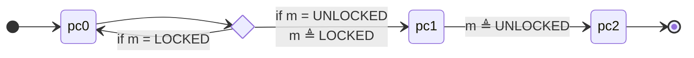

# Lecture 26: Liveness

::: warning Draft

This lecture is still a draft.

:::

## Learning outcomes

1. Understand how fairness makes liveness complicated
2. Explain the meaning of an LTL liveness specification

---

$$
\gdef\always{\box}
\gdef\eventually{\Diamond}
% \lift reuses macro and notation from Iris
$$

<!-- @include: ./macros.snippet.md -->

## Motivation

We've only talked about _safety_ so far: we prove the program "doesn't go wrong" as long as it wrongs, but the postcondition only holds if the function terminates.

Real systems also care about _liveness_ properties: proving that programs terminate and systems _eventually_ produce results.

In fact systems also care about (quantitative) _performance_ properties: achieving certain throughput or latency targets. These have generally been out of scope for verification simply because the properties are too hard to formalize (performance is a complex interplay between many factors), but there is still some work in this area.

Liveness is an important topic when reasoning about distributed systems especially.

## Example: spinlock

Consider the following implementation of a spinlock-based mutex. Three points in the control flow are labeled, pc0, pc1, and pc2; each of the two spawned threads in `main` goes through these states.

```go
type Mutex = bool;
const UNLOCKED = false;
const LOCKED = true;

func (m *Mutex) Lock() {
  // pc0
  for CompareAndSwap(m, UNLOCKED, LOCKED) {}
}

func (m *Mutex) Unlock() {
  // pc1
  *m = UNLOCKED
  // pc2
}

func main() {
  var m Mutex
  go func() {
     m.Lock()
     m.Unlock()
  }()
  go func() {
     m.Lock()
     m.Unlock()
  }()
}
```

The full state of this program can be modeled as a state machine. The state consists of a program counter for each thread (either pc0, pc1, or pc2) plus the value of the single mutex.

The state of each thread in `main` follows these transitions:



The key transition is that the `CompareAndSwap` loop advances from pc0 to pc1 only if the mutex is unlocked, and atomically sets the mutex value to locked.

Each thread independently goes through this loop.

**Exercise:** argue as rigorously as you can why the two threads must both terminate.

::: details Solution

First, we can observe that one of the two threads must win the race to acquire the mutex; they cannot both simultaneously fail.

However, why should the other thread acquire the mutex? A key issue this exercise brings up is _fairness_. The system's scheduler must run both threads "often enough" in order to guarantee that if the first thread acquires the mutex, it gets to run at some point and finish its critical section (represented by whatever happens in the pc1 state) so it can unlock the mutex. Otherwise it would be possible for the second thread to spin forever, waiting for a mutex that will never be released.

:::

## Linear Temporal Logic

To talk about liveness formally we will introduce Linear Temporal Logic (LTL). You've already seen separation logic, so this won't be your first time with these concepts.

First, the idea of linear temporal logic (at least as we're using it) is to describe traces of system behavior. That is, we will use it to describe two things: (1) what is a legal execution of our system, expressed as a sequence of stats?, and (2) what executions meet our liveness specification? The first-order logic and separation logic we've seen so far has been all about describing a single state; LTL is all about sequences of states. It turns out to be simplest to always talk about infinite sequences of states; if a system terminates at some point we'll model its execution by repeating the terminating state infinitely once it's reached.

LTL builds upon propositional logic, which we'll use to describe one state in our sequence. You can think of this in one of two ways: the state is described with a bunch of variables over finite domains (like booleans or the program counter `pc0 | pc1 | pc2` in the example above), or you can just imagine that we have formulas `State -> Prop` in Coq that describe a single state (these are not technically propositional in that these propositions could use quantifiers, but this distinction isn't important to understand LTL). We can take any such formula $\phi$ for a single state and turn it into an LTL formula with $\lift{\phi}$ (this is intentionally the same notation we used to lift pure propositions into separation logic).

$$
\begin{aligned}
P &\triangleq \lift{\phi} \\
&\quad \mid \always P \mid \eventually P \\
&\quad \mid \lnot P \mid P_1 \land P_2 \mid P_1 \lor P_2
\end{aligned}
$$

We already talked about $\lift{\phi}$ to lift single-state propositions into temporal formulas.

The second row has the key novelty of LTL: the temporal operators. $\always P$ (pronounced "always $P$") says that $P$ holds _from now onward_. $\eventually P$ (pronounced "eventually $P$") says that $P$ holds _eventually_; that is, starting at some point in the future from the current moment.

The third row has the usual connectives of a logic, negation, $P \land Q$ (logical and), and $P \lor Q$. There's nothing exceptional about these in LTL. We can write $P \implies Q$ for implication, and it's the same as $\lnot P \lor Q$ as in regular propositional logic.
