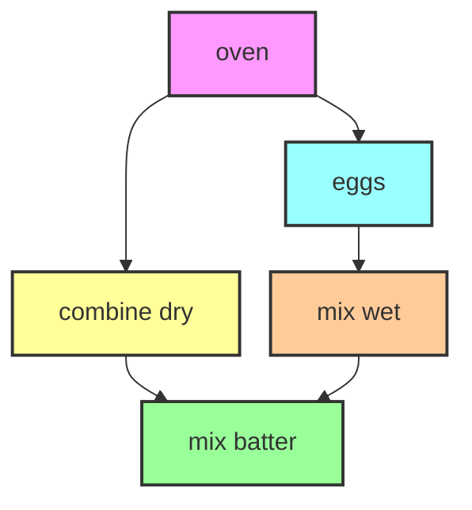
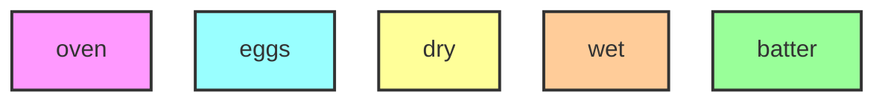
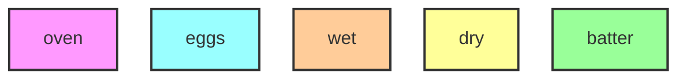

# Lecture 24: Property-based testing (PBT)

In this lecture we'll do something different and talk about _testing_. Don't worry - there is still a close relationship to verification.

## Learning outcomes

1. Explain the relationship between PBT and separation logic proofs.
2. Understand how to apply PBT to a function.
3. Articulate the tradeoff between using PBT and using verification.

## Motivation

We've spent a lot of time talking about specifications and proofs. The separation logic specifications describe code's behavior in detail (including low-level details about how memory is handled) and the proofs give high confidence that the code really meets the specification for all inputs. However, we've also spent a lot of time on proofs.

In this lecture we'll see Property-Based Testing (PBT), an approach to testing that combines thinking about specifications (similar to verification) with tooling practical to apply to code as it is being developed (similar to unit testing you've already used).

## Teaser: topological sort



What order do I actually do things in? Let's say we write a function `f` that takes the dependencies and outputs this linear order:



Let's say we change our algorithm so it emits this:



Should we update our test to check for this output now?

## Testing sorting algorithm

Consider this programming task:

```go
type Person struct {
  Name string
  Age  uint64
}

// Sort sorts arr by increasing Age.
func Sort(arr []Person) {
  // Bubble sort arr in-place
  // ... code committed ...
}
```

This example has the same feature as we saw before: if two `Person` objects have the same `Age` field, then the function does not specify what order they will be sorted in. There's more than one correct output for the same input (if Ages are repeated).

**Exercise:** What's the verification perspective on this function? Think of a specification for this example that we might verify. You can be informal about how to represent a Person mathematically; it doesn't need to be an actual Goose or Coq specification.

One thing we can say is that the new array after calling `Sort` should be sorted by age. We'll use $arr'$ to distinguish from the contents of the array prior to sorting, which we'll call $arr$.

$$
\forall i, 0 \leq i+1 < \mathtt{len}(\mathrm{arr}') \to \\
arr'[i].\mathtt{Age} \leq arr'[i+1].\mathtt{Age} \eqnlabel{(sorted)}
$$

We should also say for correctness that the set of elements in the new array is the same as before (it would be a more precise specification to say $arr'$ is a permutation of $arr$, or to compare the _multiset_ of the two lists, but those take a little more work to write down):

$$\mathrm{set}(arr') = \mathrm{set}(arr) \eqnlabel{(same elements)}$$

Now we have a specification $P(arr, arr')$ that captures the important correctness properties of Sort: the combination of the "sorted" and "same elements" properties above. In fact, $P$ covers pretty much everything about the behavior of Sort you'd want to know. This is a _relational specification_ for `Sort`, in that it relates the input and output of `Sort`.

## Property-based testing

Given a relational specification for a function, the idea of Property-Based Testing is to:

1. Implement our relational specification as a _property_ in Go (or whatever programming language we're using). This allows us to run the property and see if it held up.
2. Test the property on many random inputs; if it ever fails, our function (or property!) is wrong.
3. (optionally) On failure, find a simpler test case, record it, and turn it into a regression test.

There are a few limitations to where PBT applies:

We must be able to test the property with an implementation. This causes trouble with any quantifiers we might want in a specification: any "forall" or "exists" will be implemented in general by enumerating the possibilities, and this must be both possible (because the domain is finite) and efficient enough (because the domain is small enough) for PBT to be effective. In the sorting example, if the specification said the output is a permutation of the input, testing this by enumerating all permutations and checking them would be extremely slow.

We also must be able to generate inputs to our algorithm, and more subtly, we need to generate _interesting-enough_ inputs to actually exercise the behavior of the algorithm and find bugs. Sorting takes a list of elements, and random permutations are probably good enough. For more sophisticated inputs, generating valid inputs can be quite hard. A basic approach is to generate and then filter the valid ones. However, done naively this doesn't work: if only 1% of random inputs are valid, it will be very slow to generate inputs and the test coverage will be poor. More sophisticated testing will involve building a custom generator, and PBT frameworks have support for this. A real-world sophisticated example I know if is a generator for Rust [Cargo configurations](https://github.com/jonhoo/cargo-index-transit/blob/main/tests/proptest.rs).

If you want to learn more about the forefront of PBT I recommend reading [Property-Based Testing in Practice](https://dl.acm.org/doi/pdf/10.1145/3597503.3639581), which talks about some challenges in applying PBT at scale.

Finally, PBT works best when the code is a function. Stateful code like a data structure is difficult to get good coverage on (because we have to test sequences of inputs in order to also test functionality in different states) and harder to write properties for. A related technique for ADTs is _model-based testing_: instead of the property being relational, we compare our code under test to a simpler _model_, much like the specifications we used for ADTs. Like PBT, we can drive both the model and code under test using random sequences of inputs. Unlike the ADT proofs, the model has to be implemented in code and not just math.

## Returning to the topological sort example

Given a graph G with nodes and directed dependencies, topo(G) (should) _topologically sort_ G. It outputs a list of nodes.

**Exercise:** what relational specification does `topo(G) = ns` satisfy?

## PBT framework in Go

We'll now take a look at the API of <https://github.com/flyingmutant/rapid> and applying it to these two examples as actual Go code.

Start by reading the [godoc](https://pkg.go.dev/pgregory.net/rapid).

The API consists of two ideas:

```go
// Check runs prop many times to try to find a failure
rapid.Check(t *testing.T, prop func(*rapid.T))
// Error within a property signals failure
func (t *rapid.T) Error(args ...any)

type Generator[V any] struct { ... }
// Draw within a property creates a random input
func (g *Generator[V]) Draw(t *rapid.T, label string) V
func (g *Generator[V]) Filter(fn func(V) bool) *Generator[V]

// many ways to construct generators, for example:
func IntRange(min int, max int) *Generator[int]
```

There are two basic ideas: we write a property which signals failure with `t.Error()`, and we get input for that property by creating `Generator[V]`s and calling `Draw()` on them. The property should be interpreted as stating "for all values the generators produce, no errors will occur". Then, `rapid.Check(t, prop)` runs the property many times (with different random inputs), and if it fails it sends the failure to Go's testing infrastructure which is based on an argument `t *testing.T`.

When you use rapid, every test produces more random inputs. Eventually you might encounter a failure on a hard-to-generate input. At that point, rapid has a feature to facilitate debugging: if a test fails, rapid records the random inputs generated so that the exact failure can be reproduced. It looks like this (for a bug injected into `go/algo/topo_sort.go`):

```txt
Error:        elements differ

             extra elements in list A:
             ([]interface {}) (len=3) {
             (uint32) 4,
             (uint32) 7,
             (uint32) 1
             }


             listA:
             ([]uint32) (len=4) {
             (uint32) 4,
             (uint32) 7,
             (uint32) 1,
             (uint32) 2
             }


             listB:
             ([]uint32) (len=1) {
             (uint32) 2
             }
Test:         TestTopoSortProperties

To reproduce, specify -run="TestTopoSortProperties" -rapid.failfile="testdata/rapid/TestTopoSortProperties/TestTopoSortProperties-20241201192450-2252.fail" (or -rapid.seed=1969236383784157701)
```

The line I want to highlight is the last one:

> To reproduce, specify -run="TestTopoSortProperties" -rapid.failfile="testdata/rapid/TestTopoSortProperties/TestTopoSortProperties-20241201192450-2252.fail" (or

What that file in `testdata` actually contains is almost binary data (it looks like the sequence of random numbers generated by the pseudo-random number generator), but it's everything rapid needs to re-run this exact failure scenario.

For the topological sort test, we need the input graph to be acyclic for the algorithm to work - it actually seems to go into an infinite loop on a cyclic graph. Checking if a graph is acyclic is a bit tricky, but so is generating random edges that make up an acyclic graph. For the test in this example I implemented a function `isAcyclic` and wrote some ordinary example-based tests to get some confidence in it. This first example already illustrates one difficulty of PBT: generating valid inputs can be quite challenging.

One solution that would have made this easier is to _strengthen the specification_ of our original topological sort. Rather than making `isAcylic(g)` a precondition, we could instead adjust the algorithm to check for cycles and return a separate boolean if the input is cyclic. This would have let us easily generate valid inputs (since any graph would do), but it wouldn't solve the fundamental issue that the property of a graph being cyclic requires a quantifier over all paths through the graph and is difficult to check in an obviously correct way.
