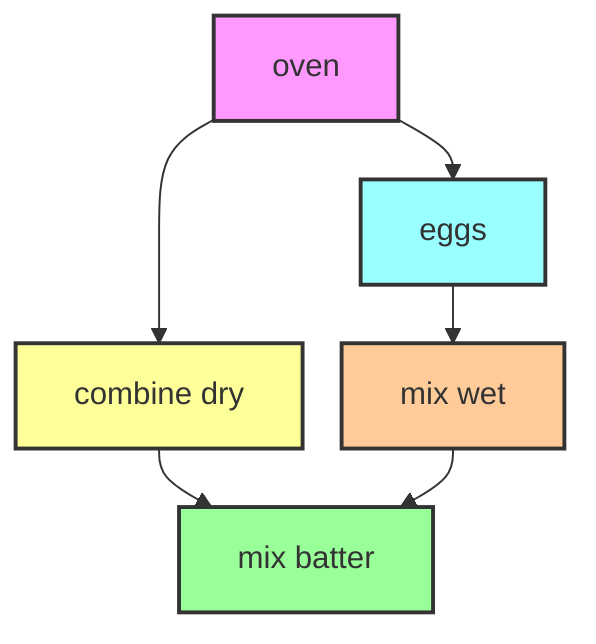
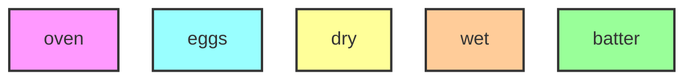
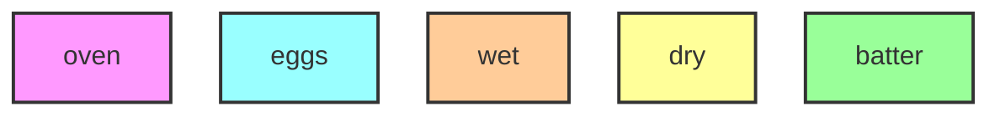

# Lecture 23: Property-based testing (PBT)

In this lecture we'll do something different and talk about _testing_.

::: warning Draft

These lectures notes are still a draft

:::

## Learning outcomes

1. Explain the relationship between PBT and separation logic proofs.
2. Understand how to apply PBT to a function.
3. Articulate the tradeoff between using PBT and using verification.

## Motivation

We've spent a lot of time talking about specifications and proofs. The separation logic specifications describe code's behavior in detail (including low-level details about how memory is handled) and the proofs give high confidence that the code really meets the specification for all inputs. However, we've also spent a lot of time on proofs.

In this lecture we'll see Property-Based Testing (PBT), an approach to testing that combines thinking about specifications (similar to verification) with tooling practical to apply to code as it is being developed (similar to unit testing you've already used).

## Teaser: topological sort



What order do I actually do things in? Let's say we write a function `f` that takes the dependencies and outputs this linear order:



Let's say we change our algorithm so it emits this:



Should we update our test to check for this output now?

## Testing sorting algorithm

Consider this programming task:

```go
type Person struct {
  Name string
  Age  uint64
}

// Sort sorts arr by increasing Age.
func Sort(arr []Person) {
  // Bubble sort arr in-place
  // ... code committed ...
}
```

This example has the same feature as we saw before: if two `Person` objects have the same `Age` field, then the function does not specify what order they will be sorted in. There's more than one correct output for the same input (if Ages are repeated).

**Exercise:** What's the verification perspective on this function? Think of a specification for this example that we might verify. You can be informal about how to represent a Person mathematically; it doesn't need to be an actual Goose or Coq specification.

One thing we can say is that the new array after calling `Sort` should be sorted by age. We'll use $arr'$ to distinguish from the contents of the array prior to sorting, which we'll call $arr$.

$$
\forall i, 0 \leq i+1 < \mathtt{len}(\mathrm{arr}') \to \\
arr'[i].\mathtt{Age} \leq arr'[i+1].\mathtt{Age} \eqnlabel{(sorted)}
$$

We should also say for correctness that the set of elements in the new array is the same as before (it would be better to simply say $arr'$ is a permutation of $arr$ but this is more work):

$$\mathrm{set}(arr') = \mathrm{set}(arr) \eqnlabel{(same elements)}$$

Now we have a specification $P(arr, arr')$ that captures the important correctness properties of Sort: the combination of the "sorted" and "same elements" properties above. In fact, $P$ covers pretty much everything about the behavior of Sort you'd want to know. This is a _relational specification_ for `Sort`, in that it relates the input and output of `Sort`.

## Property-based testing

Given a relational specification for a function, the idea of Property-Based Testing is to:

1. Implement our relational specification as a _property_ in Go (or whatever programming language we're using). This allows us to run the property and see if it held up.
2. Test the property on many random inputs; if it ever fails, our function (or property!) is wrong.
3. (optionally) On failure, find a simpler test case, record it, and turn it into a regression test.

## Returning to the topological sort example

Given a graph G with nodes and directed dependencies, topo(G) (should) _topologically sort_ G. It outputs a list of nodes.

**Exercise:** what relational specification does `topo(G) = ns` satisfy?

## PBT framework in Go

We'll now take a look at the API of <https://github.com/flyingmutant/rapid> and applying it to these two examples as actual Go code.
